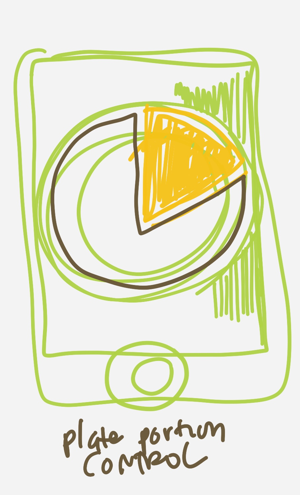
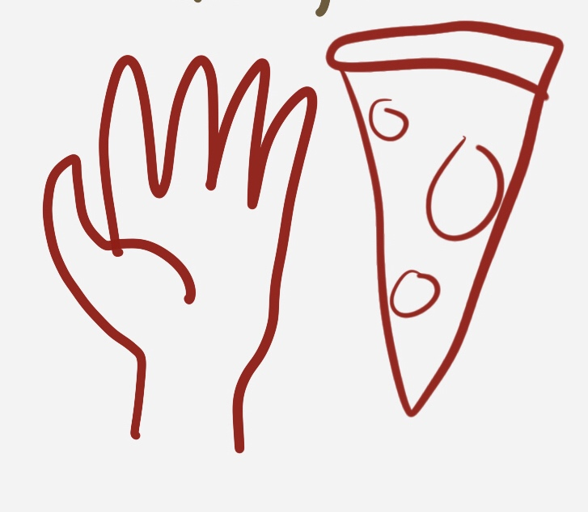
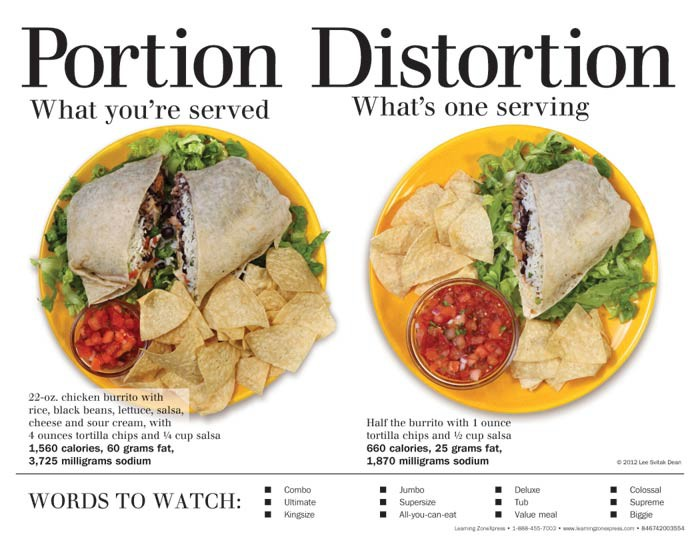

# BentoRock Redux 

Hi I'm building out an open source app. It's a redo of my old app [Bento Rock](http://www.bentorock.com), which used cartoons and photographs to encourage kids and grown-ups to eat better.

My initial app was taken down from the App Store because it was old (which is good for Apple to do). Now I'm going to rebuild it in small pieces, all online. 

It's a nice way to get feedback from other developers as well as learn the newest Swift stuff, which can be neat! This can also inspire other people who are learning to code.

# Component - Plate Portion Size

* **Problem**: Portion sizes are enormous when eating out in the USA
* **Solution**: Help people manage sensible portion sizes

This component will be an iOS view in which people can take pictures of their plates. 

* How big should a burrito be to be healthy so that they do not overeat? 
* How large should the portion of vegetables be?
* What is a sensible size for a slice of pizza?

They should be able to take a photograph of their plate, choose what kind of food they are eating, and block out the proper proportion of vegetables, protein and carbohydrates. 

# Inspiration

## Problem

The biggest health problem most Americans face, especially those that live outside of major urban centers, is the obesogenic environment. Huge portions, eating out too much, heavily processed food, and lethally addictive combinations of salt, fat and sugar make it challenging for the uninformed citizen to make the right food choices.

## Solution

Let's make a fun way for people to escape "dangerous" situations. Can we gamify navigation of obesogenic food environments in a creative way?

## Books

There are many more!

* [The End of Overeating](http://www.huffingtonpost.com/louise-mccready/d-kessler-author-of-emthe_b_195676.html) by Kessler
* [Salt, Sugar and Fat](http://www.michaelmossbooks.com) by Michael Moss
* [Food Politics](http://www.foodpolitics.com/about/) by Marion Nestle
* [Portion Distortion Posters](http://www.art.com/products/p11741822-sa-i1356007/lee-dean-portion-distortion.htm) by Lee Dean
* [Dr Human - Top 10 Big Ideas to Detox on Sugar](http://drhyman.com/blog/2014/03/06/top-10-big-ideas-detox-sugar/)
* [Bittman - Dining: Healthy Meet Deliciouss](http://www.nytimes.com/2013/04/24/dining/healthy-meet-delicious.html) 
# Images

Portion sizes are so excessive that we need a visual reminder to show us what a normal eating portion should be (in order to maintain a desired weight)

How large should a pizza slice be? Is there a way to note and mark down.

Lee Dean's posters on the proper serving sizes for things like Burritos is so awesome

